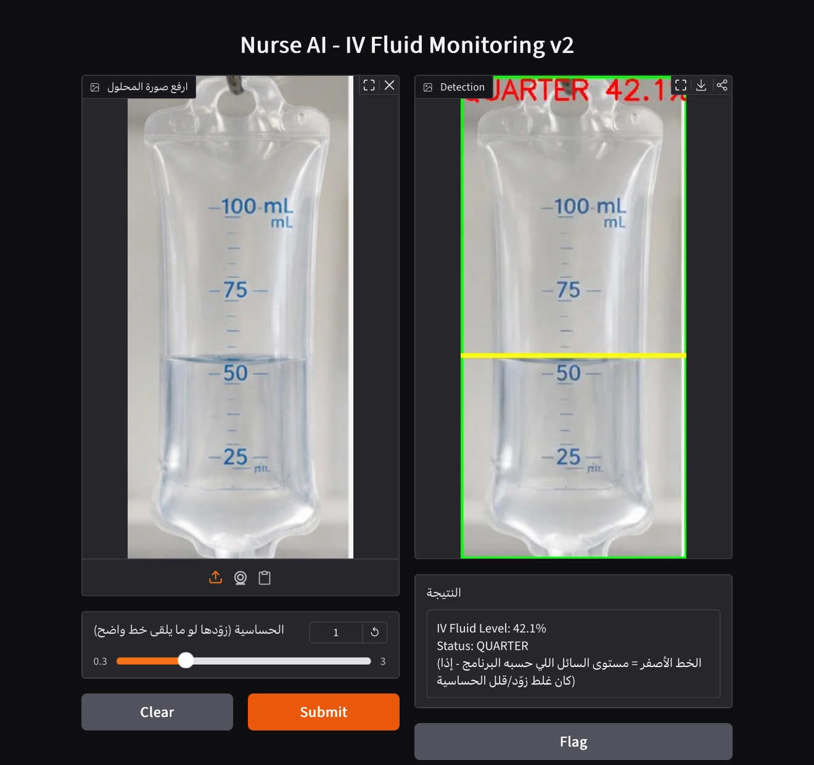

# NurseVision-All
NurseVision AI is a Computer Vision solution for real-time IV fluid bag monitoring using YOLO. Built during the SDA × Atomcamp Computer Vision Bootcamp, the project promotes Responsible AI and won the Most Responsible AI Solution and Best Technical Improvement award
# 🏥 NurseVision AI
## Project Demo

NurseVision AI is a Computer Vision solution for real-time IV fluid bag monitoring using YOLO. The system helps healthcare professionals by detecting IV bag status and providing timely alerts while following Responsible AI principles.

## 🚀 Features
- Real-time IV bag monitoring
- YOLO-based object detection
- Automated alerts
- Responsible AI implementation

## 🛠️ Technologies
- Python
- YOLO
- OpenCV
- Google Colab

## 🏆 Awards
- Most Responsible AI Solution
- Best Technical Improvement

Developed during the **Computer Vision Bootcamp** organized by **SDA × Atomcamp** at **Riyadh Elm University**.
